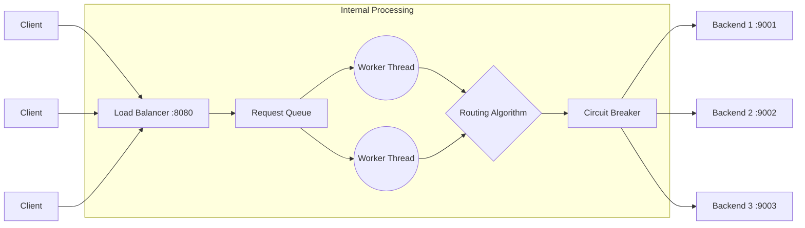

# NAEHA Load Balancer

A "how-did-she-build-that" raw-socket HTTP load balancer built entirely from scratch in Python. No `nginx`, no `Flask`, just pure TCP streams and standard libraries.

## 🚀 Features

- **Zero Dependencies:** Pure Python standard library (no external packages).
- **Advanced LB Algorithms:** Round Robin, Least Connections, Weighted, and IP Hash.
- **Circuit Breaker:** Netflix-style failure detection (`CLOSED` → `OPEN` → `HALF_OPEN`).
- **Rate Limiting:** Built-in Token Bucket per-IP rate limiting (returns HTTP 429).
- **Streaming Support:** Full support for `Transfer-Encoding: chunked` and large files.
- **Observability:** Prometheus-compatible `/metrics`, structured JSON access logs, and a live terminal dashboard.
- **Built-in Benchmarking:** Self-contained load testing mode.

## 🏛️ Architecture



## ⚡ Quickstart

Run it straight from the terminal (starts mock backends automatically):
```bash
python load_balancer.py
```

Run the built-in benchmark mode to see it under pressure:
```bash
python load_balancer.py --benchmark --duration 10 --concurrency 50
```

### Or using Docker:
```bash
docker compose up --build
```
And open `http://localhost:8080/`

## 🛠️ Controls
While running, use these hotkeys in the terminal UI:
- `1` / `2` / `3` / `4` - Switch algorithm (Round Robin / Least Conn / Weighted / IP Hash)
- `m` - Cycle through demo load profiles (LIVE, CHAOS, STRESS TEST, FAILOVER)
- `7` / `8` / `9` - Force failover of Backend 1 / 2 / 3
- `q` - Graceful shutdown

## 📊 Endpoints
- **Traffic Demo:** `GET /`
- **Metrics:** `GET /metrics`
- **Health Check:** `GET /lb/health`
- **JSON Status:** `GET /lb/status`
